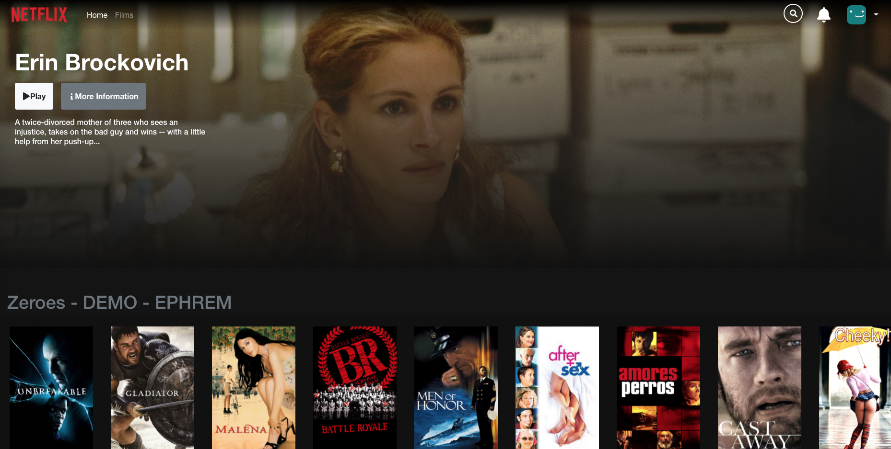

# Netflix Movie Cloning

## This repository is all bout NETFLIX cloning project in ReactJS for educational purpose.

> In collaboration with:<br/>
>
> - Front-End-Developers -- @Manon, @Elias, @Frankie, @Ryno, @Adrienn, @Joeri, @Patrick, @Justin & @Ephrem.<br/>
> - Back-End-Developers -- @Izzet & @Michell.

TOOLS USED:

- React JS
- Firebase
- Bootstrap
- TMDB api

CONFIGURATION & FILE / FOLDER STRUCTURES:

```

├── node_modules
├── public
│ ├── index.html
│ ├── manifest.json
│ └── robots.txt
│
├── src
│ ├── Assets
│ │  ├── images
│ │  └── Styles
│ │     └── SASS
│ │
├── Components
│ ├── Contents
│ │ │── FooterContents
│ │ │ │── FooterCallAction.js
│ │ │ │── FooterCopyright.js
│ │ │ │── FooterGuest.js
│ │ │ └── Social.js
│ │ │
│ │ │── HeaderContents
│ │ │ │── HeaderNav.js
│ │ │ └── SearchBar.js
│ │ │
│ │ │── MovieContents
│ │ │ │── Carousel.js
│ │ │ │── CatOverview.js
│ │ │ │── CatSlider.js
│ │ │ │── FeaturedBanner.js
│ │ │ │── FilmsCategories.js
│ │ │ │── HomeCategories.js
│ │ │ └── MovieCard.js
│ │ │
│ ├── Forms
│ │ │── Button.js
│ │ │── FormInput.js
│ │ │── PasswordReset.js
│ │ │── SignIn.js
│ │ └── SignUp.js
│ │
│ ├── Layout
│ │ │── Footer.jsx
│ │ │── Header.jsx
│ │ └── Navigation.jsx
│ │
│ ├── Pages
│ │ │── MainPages
│ │ │ │── DetailScreen.jsx
│ │ │ │── FilmsScreen.jsx
│ │ │ └── HomeScreen.jsx
│ │ │── UserPages
│ │ │ │── LandingScreen.jsx
│ │ │ │── LogInScreen.jsx
│ │ │ │── LogOutScreen.jsx
│ │ │ │── DashboardScreen.jsx
│ │ │ │── RecoveryScreen.jsx
│ │ │ └── RegistrationScreen.jsx
│ │ │
├────────────
├── firebase
│ ├── config.js
│ └── utils.js
│
├── utilities
│ ├── axios.jsx
│ └── config.jsx
│
├── App.js
├── index.js
├── .env
├── .gitignore
├── instructions.md
├── package.json
├── README.md
├── SECURITY.md
└────────────
```

### TechGrounds Web Development, October / 2021



